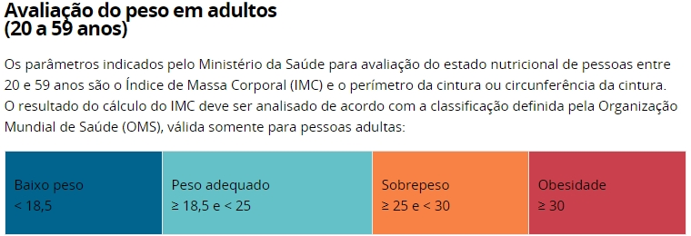
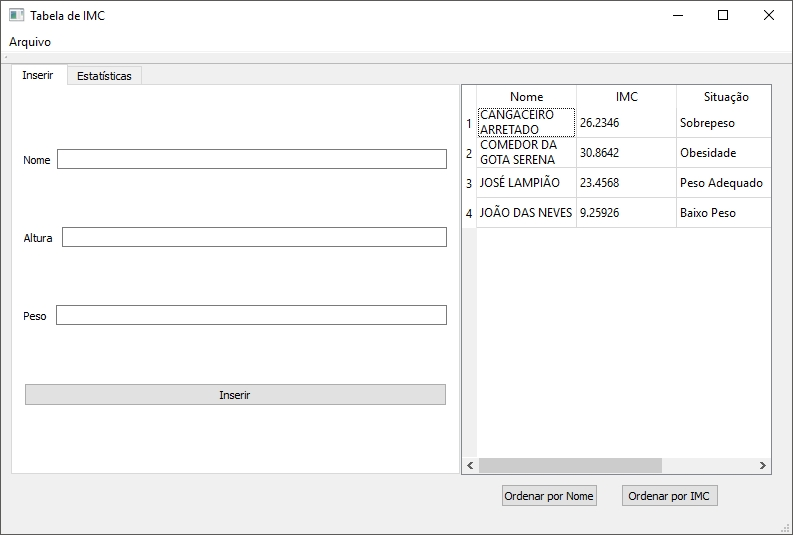
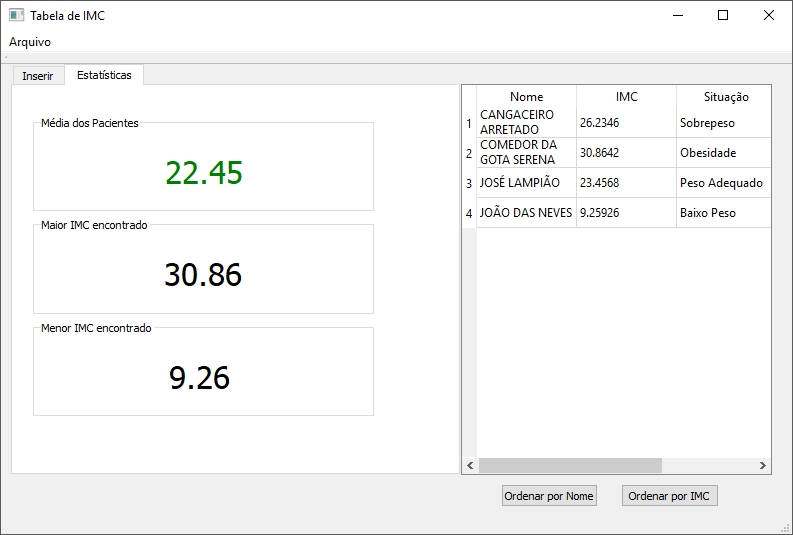
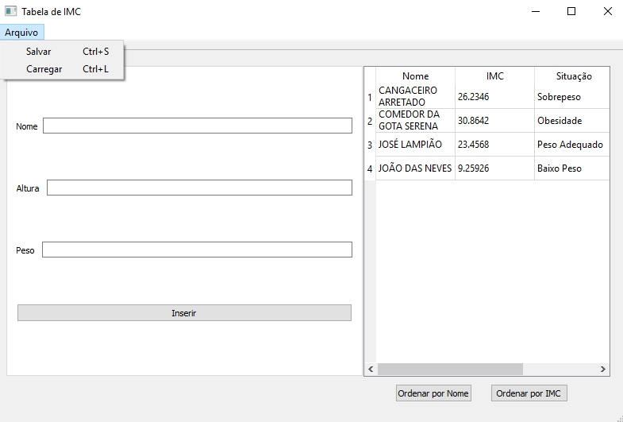

# Tabela de IMC
### O que é IMC?
O Índice de Massa Corporal(IMC) é o padrão internacional, adotado pela Organização Mundial de Saúde (OMS), utilizado para detectar a 
obesidade/desnutrição, e o seu grau – o que influencia diretamente em questões de saúde. O sobrepeso/obesidade e a desnutrição/anemia, que 
podem ser revelados ao aplicar o índice, são a porta de entrada para diversas doenças consideradas de alto risco.O índice é obtido a partir
do seguinte cálculo: IMC = Peso/Altura^2. 
Ao se calcular o IMC de um índividuo, com o dado,é possível também determinar possíveis causas socio-ecônomicas que venham a influenciar 
uma possível condição no índividuo. Diante deste fato, a OMS disponibiliza uma "tabela" de IMC para cada país, que é conferida pelo orgão 
responsável pela saúde da localidade em questão. Os dados base consideram a etnia, padrões corporais predominantes, assim como uma 
faixa etária específica de individuos que possuem estilos de vida semelhantes.
Diante de tais fatos, podemos concluir que o ìndice de Massa Corporal não é só um valor tabelado, e sim, uma pesquisa massiva de 
casos,um estudo aprofundado de diversas áreas, variando desde medicina, até as ciências sócioecônomicas.
Para o Brasil, o Ministério da Saúde(MS) disponibiliza a seguinte tabela:
  

(Disponível em: http://portalms.saude.gov.br/component/content/article/804-imc/40509-imc-em-adultos)

## Ferramenta Desenvolvida 
Dentro da Problemática apresentada, e de modo a contribuir na aquisição, manutenção e na observação dos dados referentes ao 
Ìndice de Massa Corporal, foi pensado o desenvolvimento de um Software,baseado na ferramenta de desenvolvimento de interfaces gráficas,
"qtCreator", que fosse capaz de armazenar dados de indivíduos a fim de se calcular o IMC de forma automática, mostrando o estado em 
que o ìndivíduo se encontra tendo como base a relação com a tabela estipulada pelo Minitério da Saúde.
 
### Funcionalidades
O programa apresentado conta com duas abas, sendo a primeira aba, conforme mostrado abaixo, o setor para entrada de dados, onde é 
possível armazenar o nome do paciente,sua altura, e peso, que serão salvos e exibidos na tabela quando o usuário pressionar o botão 
"Inserir".

A segunda aba do programa conta com uma análise estatística dos dados, mostrando a média de todos os IMC's salvos, 
o maior e o menor encontrado.

As duas abas apresentam funcionalidades em comum, como a possibilidade de se observar e ordenar a tabela por Ordem alfabética dos nomes, ou
por IMC(em ordem crescente).Também é possível salvar os dados da tabela em um arquivo ".txt" acessando no menu do canto superior esquerdo,
que além de salvar, também consegue carregar valores para a tabela de arquivos salvos no mesmo formato.

